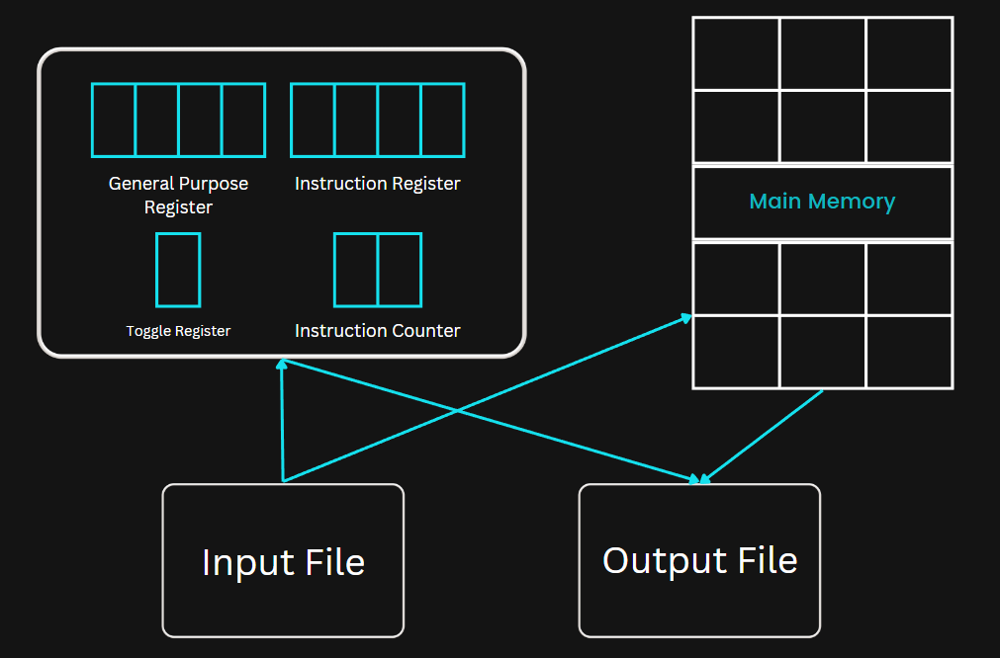

# MULTIPROGRAMMING OPERATING SYSTEM
- Used for execution of multiple jobs
- Job should be defined ,well structured.
- System Will Report Error ,For Wrong Jobs With Proper Error Messages.
- Series of Jobs should be kept in input.txt.
- Afer processing of jobs output can be seen output.txt
- Random memory allocation for program card used using paging.

  
## MACHINE SPECIFICATIONS
  The MOS computer is described from two points of view: the “virtual” machine seen by the
  typical user and the “real” machine used by the MOS designer/implementer.

## The Virtual Machine:
- Storage: The storage consists of a maximum of 100 words, addressed from 00 to 99. Each word is divided into four one-byte units, allowing for a wide range of characters acceptable by the host machine.
- CPU: The CPU has three registers of interest:
  - General Register (R): A four-byte register used for general-purpose operations.
  - Boolean Toggle (C): A one-byte register that can hold either 'T' (true) or 'F' (false).
  - Instruction Counter (IC): A two-byte register that keeps track of the current instruction's address.
    
    
    
- Instruction: Instructions are divided into two parts:
  - Operation Code (Opcode): The two high-order bytes of the word represent the operation code of an instruction.
  - Operand Address: The two low-order bytes of the word indicate the address of the operand in the storage.
    
  ## Instruction Set
  
  
    
     |       Instruction             |                              
     |   Opcode    |    Operand      |            Description                  |
     |-------------|-----------------|-----------------------------------------|
     | GD          |       -         | Read the first 40 columns of a card     |
     | PD          |       -         | Print a new line of 40 characters       |
     | LR          |    Address      | Load a word from storage into R         |
     | SR          |    Address      | Store the content of R into storage     |
     | CR          |    Address      | Compare the content of R with storage   |
     | BT          |    Address      | Branch to the specified address if C=T  |
     | H           |      -          | Halt the program execution              |
    

   

## Tools used
- Gcc compiler
- Gdb

